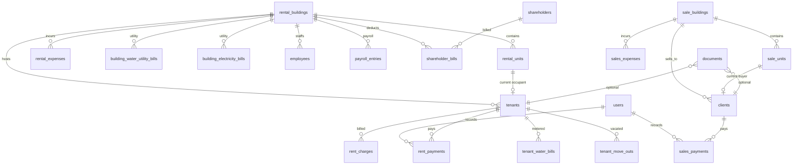

# Data Model — Rent & Sales Management Platform

**Date:** 2026-06-30  
**Status:** Step 2 — awaiting review (migrations created; **do not run `migrate` until approved**)  
**Prerequisites:** `REQUIREMENTS.md`, `ARCHITECTURE.md`  
**Database:** PostgreSQL 16+  
**Money type:** `decimal(14,2)` — KES, half-up rounding to 2 dp  
**Billing periods:** `billing_month` (1–12) + `billing_year` (4-digit int)

---

## 1. Design principles

| Principle | Implementation |
|-----------|----------------|
| Foreign keys | All relationships enforced at DB level |
| Legacy mapping | `legacy_id` nullable unique column on domain tables for Step 5 ETL |
| Actor attribution | `created_by` / `updated_by` → `users.id` on financial rows |
| Void / cancel | Status columns — no shadow delete tables |
| File blobs | `documents` polymorphic table — not in entity rows |
| Tenant retirement | `status = inactive` + `tenant_move_outs` log — no hard delete in API |
| Client retirement | `status = disabled` — apartment freed, payments block delete |

---

## 2. Entity relationship overview



---

## 3. Shared tables

### 3.1 `users`

| Column | Type | Notes |
|--------|------|-------|
| `id` | bigint PK | |
| `name` | varchar(255) | Display name |
| `username` | varchar(200) unique | Login identifier (legacy parity) |
| `email` | varchar(255) nullable unique | Optional in v1 |
| `password` | varchar(255) | bcrypt hash |
| `role` | enum | `rental`, `sales` |
| `status` | enum | `active`, `inactive` |
| `remember_token` | varchar | Sanctum / session |
| `timestamps` | | |

**Legacy:** `users` — `type` → `role` (`Rental`→`rental`, `Sales`→`sales`); `status` `Active`→`active`.

### 3.2 `documents`

Polymorphic file metadata (replaces `longblob` on `clients.photo`, `clients.sign`, `tenants.PassImage`).

| Column | Type | Notes |
|--------|------|-------|
| `id` | uuid PK | Public download identifier |
| `documentable_type` | varchar | `App\Domain\Rental\Models\Tenant`, etc. |
| `documentable_id` | bigint | |
| `kind` | enum | `photo`, `signature`, `id_document` |
| `disk` | varchar | `local`, `s3` |
| `path` | varchar | Storage path |
| `mime_type` | varchar | |
| `size_bytes` | bigint | |
| `uploaded_by` | FK users | |
| `timestamps` | | |

---

## 4. Rental domain

### 4.1 `rental_buildings`

**Legacy:** `categories`

| Column | Type | Notes |
|--------|------|-------|
| `id` | bigint PK | |
| `legacy_id` | int nullable unique | `categories.id` |
| `name` | varchar(200) | |
| `timestamps` | | |

### 4.2 `rental_units`

**Legacy:** `houses` (`aid` → `legacy_id`)

| Column | Type | Notes |
|--------|------|-------|
| `id` | bigint PK | |
| `legacy_id` | int nullable unique | `houses.aid` |
| `rental_building_id` | FK | `houses.category_id` |
| `house_number` | varchar(50) | `house_no` |
| `floor` | varchar(50) | |
| `description` | text | |
| `monthly_rent` | decimal(14,2) | `price` |
| `status` | enum | `vacant`, `occupied` |
| `timestamps` | | |

### 4.3 `tenants`

**Legacy:** `tenants` (`ClientID` → `legacy_id`)

| Column | Type | Notes |
|--------|------|-------|
| `id` | bigint PK | |
| `legacy_id` | int nullable unique | |
| `rental_building_id` | FK | `HouseID` |
| `rental_unit_id` | FK | `apartmentNo` → unit `aid` |
| `name` | varchar(100) | `ClientName` |
| `phone` | varchar(30) | |
| `gender` | varchar(20) nullable | |
| `email` | varchar(100) nullable | |
| `passport_or_id` | varchar(50) nullable | `Passport` |
| `deposit` | decimal(14,2) default 0 | `Deposit` |
| `service_amount` | decimal(14,2) default 0 | Monthly service charge |
| `requires_water_metering` | boolean default false | Agreement requires tenant water meter reading each period |
| `requires_electricity_metering` | boolean default false | Agreement requires tenant electricity meter reading (future) |
| `next_of_kin_name` | varchar(100) nullable | `nextname` |
| `next_of_kin_address` | varchar(200) nullable | `anddress` |
| `next_of_kin_id` | varchar(50) nullable | `npassid` |
| `next_of_kin_phone` | varchar(30) nullable | `nphone` |
| `start_date` | date nullable | `starteddate` |
| `status` | enum | `active`, `inactive` |
| `created_by` | FK users nullable | `username` |
| `timestamps` | | |

**Not reproduced:** `PassImage` blob conflated with status in legacy forms.

### 4.4 `tenant_move_outs`

**Legacy:** `moved_out`

| Column | Type | Notes |
|--------|------|-------|
| `id` | bigint PK | |
| `legacy_id` | int nullable unique | |
| `tenant_id` | FK | |
| `rental_building_id` | FK | `houseid` |
| `rental_unit_id` | FK | `aptno` |
| `refund_amount` | decimal(14,2) default 0 | `refund` |
| `reason` | varchar(500) | |
| `moved_out_at` | date | `action_date` |
| `recorded_by` | FK users | `username` |
| `timestamps` | | |

### 4.5 `rent_charges`

**Legacy:** `charge` (`clientid` = tenant id)

| Column | Type | Notes |
|--------|------|-------|
| `id` | bigint PK | |
| `legacy_id` | int nullable unique | |
| `tenant_id` | FK | `clientid` |
| `rental_unit_id` | FK | `apartmentNo` |
| `rental_building_id` | FK | `houseid` |
| `billing_month` | tinyint 1–12 | Derived from `charge_date` |
| `billing_year` | smallint | |
| `rent_amount` | decimal(14,2) | `rent` |
| `service_amount` | decimal(14,2) | `service` |
| `total_amount` | decimal(14,2) | `total` = rent + service |
| `purpose` | varchar(50) default `Rent + service` | Also `Water`, `Electricity`, `Adjustment` |
| `tenant_water_bill_id` | FK nullable | Links utility charge to meter bill |
| `tenant_electricity_bill_id` | FK nullable | Links utility charge to meter bill |
| `charge_batch_item_id` | FK nullable | Set when posted from approved batch item |
| `charged_at` | timestamp | `charge_date` |
| `timestamps` | | |

**Note:** Multiple rows per tenant per period are allowed (rent+service, water, electricity). Balance uses `SUM(total_amount)`.

### 4.5a `charge_batches` (monthly billing engine)

Per-building draft → approve → lock workflow. One batch per `(rental_building_id, billing_month, billing_year)`.

| Column | Type | Notes |
|--------|------|-------|
| `id` | bigint PK | |
| `rental_building_id` | FK | |
| `billing_month` | tinyint | |
| `billing_year` | smallint | |
| `status` | enum | `draft`, `partially_approved`, `locked` |
| `generated_by` | FK users | |
| `generated_at` | timestamp | |
| `locked_by` | FK users nullable | |
| `locked_at` | timestamp nullable | |

### 4.5b `charge_batch_items`

One row per tenant per charge type per batch (`rent`, `service`, `water`, `electricity`).

| Column | Type | Notes |
|--------|------|-------|
| `item_status` | enum | `draft`, `pending`, `approved`, `excluded` |
| `pending_reason` | varchar nullable | e.g. missing meter reading |
| `exclusion_reason` | varchar nullable | Required when excluded |
| `manually_adjusted` | boolean | Audit flag for edited amounts |

Approved items post to `rent_charges` (rent+service merge into one row).

### 4.5c `charge_adjustments`

Post-lock credit/correction entries (manager-only). Creates linked `rent_charges` row with `purpose = Adjustment`.

### 4.6 `rent_payments`

**Legacy:** `payments`

| Column | Type | Notes |
|--------|------|-------|
| `id` | bigint PK | |
| `legacy_id` | int nullable unique | |
| `tenant_id` | FK | |
| `rental_building_id` | FK | `houseid` |
| `amount` | decimal(14,2) | |
| `discount` | decimal(14,2) default 0 | Reduces balance like payment |
| `invoice_reference` | varchar(50) | `invoice` |
| `paid_at` | timestamp | `date_created` |
| `status` | enum | `active`, `voided` |
| `voided_at` | timestamp nullable | |
| `voided_by` | FK users nullable | |
| `created_by` | FK users | `username` |
| `updated_by` | FK users nullable | |
| `timestamps` | | |

**Balance formula:** `SUM(rent_charges.total_amount) − SUM(active payments.amount + discount)`.

**Category breakdown (display & implied allocation):** Outstanding amounts shown per category are derived by applying the payment pool in order: **water → services → rent**. Payments are stored as a single lump sum (no per-category allocation rows). Overpayments produce a negative total due (credit balance) applied automatically to future charges.

### 4.7 `tenant_water_bills`

**Legacy:** `water_bill` + `status` from `water_bill_new`

| Column | Type | Notes |
|--------|------|-------|
| `id` | bigint PK | |
| `legacy_id` | int nullable unique | |
| `tenant_id` | FK | |
| `rental_building_id` | FK | `houseid` |
| `billing_month` | tinyint | Replaces `month_id` name |
| `billing_year` | smallint | |
| `previous_reading` | int | `pr` |
| `current_reading` | int | `cr` |
| `consumption` | int | `cr − pr` |
| `rate` | decimal(14,2) | Per-unit rate |
| `fixed_fee` | decimal(14,2) | `charged_fee` (semantic fix) |
| `amount` | decimal(14,2) | Total bill |
| `amount_paid` | decimal(14,2) nullable | Set when marked paid |
| `status` | enum | `pending`, `paid` |
| `remark` | varchar(500) | |
| `created_by` | FK users | `username` |
| `timestamps` | | |

**Unique:** `(tenant_id, billing_month, billing_year)`.

### 4.8 `building_water_utility_bills`

**Legacy:** `kenya_water`

| Column | Type | Notes |
|--------|------|-------|
| `id` | bigint PK | |
| `legacy_id` | int nullable unique | |
| `rental_building_id` | FK | `house_id` |
| `billing_month` | tinyint | |
| `billing_year` | smallint | |
| `amount` | decimal(14,2) | |
| `remark` | varchar(500) | |
| `billed_at` | date | `date_created` |
| `created_by` | FK users | `username` |
| `timestamps` | | |

**Unique:** `(rental_building_id, billing_month, billing_year)` — enforced (legacy rent fork had this commented out).

### 4.9 `building_electricity_bills`

**Legacy:** `electricity`

| Column | Type | Notes |
|--------|------|-------|
| `id` | bigint PK | |
| `legacy_id` | int nullable unique | `eid` |
| `rental_building_id` | FK | `houseid` |
| `billing_month` | tinyint | |
| `billing_year` | smallint | |
| `amount` | decimal(14,2) | Was varchar in legacy |
| `remark` | varchar(500) | |
| `billed_at` | date | `date` |
| `timestamps` | | |

### 4.10 `rental_expenses`

**Legacy:** `expenses`

| Column | Type | Notes |
|--------|------|-------|
| `id` | bigint PK | |
| `legacy_id` | int nullable unique | `expid` |
| `rental_building_id` | FK | `house_id` |
| `name` | varchar(200) | `expensename` |
| `amount` | decimal(14,2) | `amountpaid` |
| `description` | varchar(500) | |
| `expense_date` | timestamp | `expensedate` |
| `timestamps` | | |

### 4.11 `employees`

**Legacy:** `employee`

| Column | Type | Notes |
|--------|------|-------|
| `id` | bigint PK | |
| `legacy_id` | int nullable unique | `empid` |
| `rental_building_id` | FK nullable | `houseid` |
| `name` | varchar(100) | `empname` |
| `address` | varchar(200) nullable | |
| `salary` | decimal(14,2) | Base salary |
| `phone` | varchar(30) nullable | |
| `position` | varchar(100) | |
| `status` | enum | `current`, `former` |
| `timestamps` | | |

### 4.12 `payroll_entries`

**Legacy:** `payroll`

| Column | Type | Notes |
|--------|------|-------|
| `id` | bigint PK | |
| `legacy_id` | int nullable unique | `payrollid` |
| `employee_id` | FK | `empid` |
| `rental_building_id` | FK | `house_id` |
| `billing_month` | tinyint | |
| `billing_year` | smallint | |
| `salary_amount` | decimal(14,2) | `salary` |
| `paid_at` | timestamp | `date` |
| `created_by` | FK users | `username` |
| `timestamps` | | |

### 4.13 `shareholders`

**Legacy:** `shareholders`

| Column | Type | Notes |
|--------|------|-------|
| `id` | bigint PK | |
| `legacy_id` | int nullable unique | |
| `name` | varchar(100) | |
| `phone` | varchar(40) nullable | |
| `address` | varchar(200) nullable | |
| `timestamps` | | |

### 4.14 `shareholder_bills`

**Legacy:** `shareholders_bill`

| Column | Type | Notes |
|--------|------|-------|
| `id` | bigint PK | |
| `legacy_id` | int nullable unique | `bill_id` |
| `shareholder_id` | FK | |
| `rental_building_id` | FK | `house_id` |
| `amount` | decimal(14,2) | |
| `remark` | varchar(500) | |
| `bill_date` | date | |
| `timestamps` | | |

---

## 5. Sales domain

### 5.1 `sale_buildings`

**Legacy:** `buildings`

| Column | Type | Notes |
|--------|------|-------|
| `id` | bigint PK | |
| `legacy_id` | int nullable unique | |
| `name` | varchar(200) | |
| `timestamps` | | |

### 5.2 `sale_units`

**Legacy:** `forsale_apt`

| Column | Type | Notes |
|--------|------|-------|
| `id` | bigint PK | |
| `legacy_id` | int nullable unique | `aid` |
| `sale_building_id` | FK | `category_id` |
| `house_number` | varchar(50) | |
| `floor` | varchar(50) | |
| `description` | text | |
| `list_price` | decimal(14,2) | `price` |
| `status` | enum | `available`, `sold` |
| `timestamps` | | |

### 5.3 `clients`

**Legacy:** `clients` (+ `clients_del` merged via status)

| Column | Type | Notes |
|--------|------|-------|
| `id` | bigint PK | |
| `legacy_id` | int nullable unique | `ClientID` |
| `sale_building_id` | FK | `HouseID` |
| `sale_unit_id` | FK | `apartmentNo` |
| `name` | varchar(100) | `ClientName` |
| `phone` | varchar(30) | |
| `gender` | varchar(20) nullable | |
| `email` | varchar(100) nullable | |
| `passport_or_id` | varchar(50) nullable | |
| `agreed_sale_price` | decimal(14,2) | Legacy `PassImage` (price) |
| `voucher_number` | varchar(50) nullable | Legacy `service_amount` |
| `deposit` | decimal(14,2) default 0 | |
| `next_of_kin_name` | varchar(100) nullable | |
| `next_of_kin_address` | varchar(200) nullable | |
| `next_of_kin_id` | varchar(50) nullable | |
| `next_of_kin_phone` | varchar(30) nullable | |
| `registration_date` | date nullable | `starteddate` |
| `status` | enum | `active`, `disabled` |
| `created_by` | FK users nullable | `createby` |
| `timestamps` | | |

Photo/signature via `documents` polymorphic relation.

### 5.4 `sales_payments`

**Legacy:** `cpayments` + `cpayments_del` (status column replaces archive)

| Column | Type | Notes |
|--------|------|-------|
| `id` | bigint PK | |
| `legacy_id` | int nullable unique | |
| `client_id` | FK | `tenant_id` in legacy cpayments |
| `sale_building_id` | FK | `houseid` |
| `amount` | decimal(14,2) | |
| `discount` | decimal(14,2) default 0 | |
| `invoice_reference` | varchar(50) | `invoice` |
| `bank` | varchar(100) nullable | |
| `remark` | varchar(200) nullable | |
| `paid_at` | timestamp | `date_created` |
| `status` | enum | `active`, `cancelled` |
| `cancelled_at` | timestamp nullable | |
| `cancelled_by` | FK users nullable | |
| `created_by` | FK users nullable | `username` |
| `updated_by` | FK users nullable | |
| `timestamps` | | |

**Balance formula:** `agreed_sale_price − deposit − SUM(active amount) − SUM(active discount)`.

### 5.5 `sales_expenses`

**Legacy:** `cexpenses`

| Column | Type | Notes |
|--------|------|-------|
| `id` | bigint PK | |
| `legacy_id` | int nullable unique | `expid` |
| `sale_building_id` | FK | `house_id` |
| `name` | varchar(200) | `expensename` |
| `amount` | decimal(14,2) | `amountpaid` |
| `description` | varchar(500) | |
| `expense_date` | timestamp | `expensedate` |
| `timestamps` | | |

---

## 6. Legacy table mapping (rent & sales scope)

| Legacy table | New table(s) | Migration notes |
|--------------|--------------|-----------------|
| `users` | `users` | Hash passwords; map `type` → `role` |
| `categories` | `rental_buildings` | |
| `houses` | `rental_units` | `aid` → `legacy_id`; status `Vacant`/`Occupied` → lowercase |
| `tenants` | `tenants` | Map `apartmentNo` string → `rental_unit_id` via `houses.aid` |
| `moved_out` | `tenant_move_outs` | |
| `charge` | `rent_charges` | Parse `charge_date` → month/year |
| `payments` | `rent_payments` | All `active`; no void history in legacy |
| `water_bill` | `tenant_water_bills` | Default `status = paid` if in `water_bill_new` |
| `water_bill_new` | *(merge into above)* | Status source only |
| `kenya_water` | `building_water_utility_bills` | Map month names → 1–12 |
| `electricity` | `building_electricity_bills` | Cast `amount` varchar → decimal |
| `expenses` | `rental_expenses` | |
| `employee` | `employees` | `Current` → `current` |
| `payroll` | `payroll_entries` | Skip rows with `month_id = 'Select Month'` or fix in ETL |
| `shareholders` | `shareholders` | |
| `shareholders_bill` | `shareholder_bills` | |
| `buildings` | `sale_buildings` | |
| `forsale_apt` | `sale_units` | `Available`/`Sold` → lowercase |
| `clients` | `clients` | `PassImage` → `agreed_sale_price`; blobs → `documents` |
| `clients_del` | `clients` | `status = disabled` |
| `cpayments` | `sales_payments` | `status = active` |
| `cpayments_del` | `sales_payments` | `status = cancelled` |
| `cexpenses` | `sales_expenses` | |

**Deferred / excluded:** `build_site`, `materials`, `company`, `deposits`, `withdraw`, `system_settings`, `otherincome`, `otherexpense`, `water_bill_charge` (nonexistent).

---

## 7. Month name → integer mapping (Step 5 ETL)

Legacy stores month names (`July`, `Select Month`, etc.). Migration script must map:

| Legacy | `billing_month` |
|--------|-----------------|
| January | 1 |
| February | 2 |
| … | … |
| December | 12 |
| Invalid / empty | Flag for manual review |

---

## 8. Indexes summary

| Table | Index / unique |
|-------|----------------|
| All domain tables | `legacy_id` unique where not null |
| `rent_charges` | unique `(tenant_id, billing_month, billing_year)` |
| `tenant_water_bills` | unique `(tenant_id, billing_month, billing_year)` |
| `building_water_utility_bills` | unique `(rental_building_id, billing_month, billing_year)` |
| `rent_payments` | index `(tenant_id, status)` |
| `sales_payments` | index `(client_id, status)` |
| `tenants` | index `(status)`, index `(rental_building_id)` |
| `clients` | index `(status)`, index `(sale_building_id)` |

---

## 9. Migration files

Located in `backend/database/migrations/`:

| File | Tables |
|------|--------|
| `0001_01_01_000000_create_users_table.php` | `users`, sessions (modified) |
| `2026_06_30_000001_create_documents_table.php` | `documents` |
| `2026_06_30_000010_create_rental_domain_tables.php` | buildings → shareholder_bills |
| `2026_06_30_000020_create_sales_domain_tables.php` | sale buildings → sales_expenses |

**Not run yet.** Review migrations, then:

```bash
cd backend
cp .env.example .env   # set DB_* for PostgreSQL
php artisan migrate
```

---

## 10. Step 2 checklist

| Item | Status |
|------|--------|
| `DATA_MODEL.md` (this file) | ✓ |
| Laravel migrations | ✓ Created — not executed |
| `REQUIREMENTS.md` / `ARCHITECTURE.md` copied | ✓ |
| `docker-compose.yml` | ✓ |
| `php artisan migrate` | ✗ Awaiting your review |

---

*Next step after approval: **Step 3** — Sanctum auth, models, policies, API foundation.*
